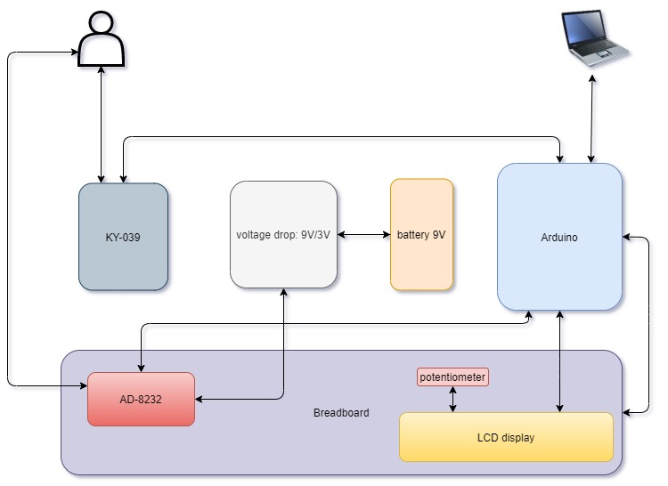
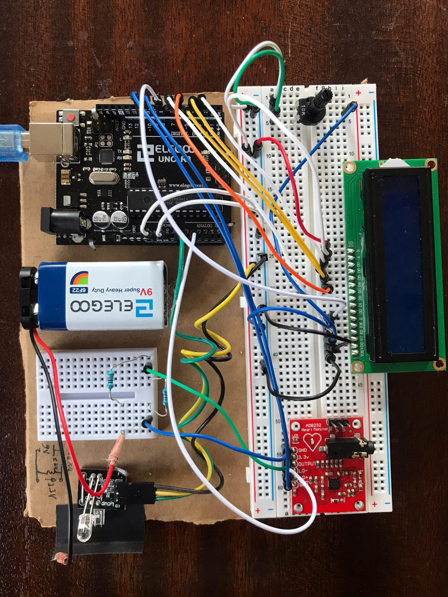
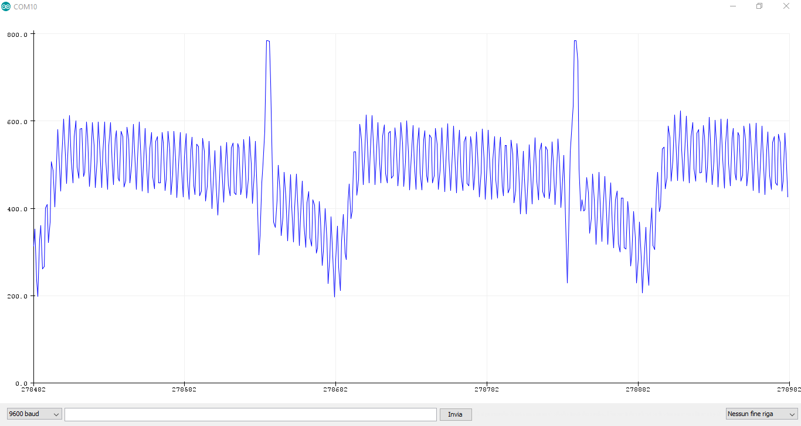
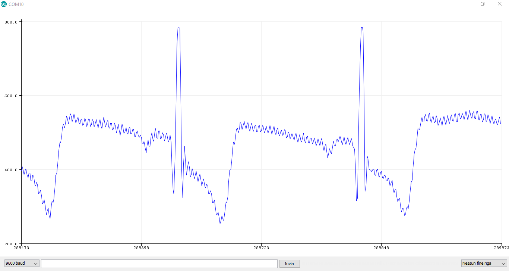
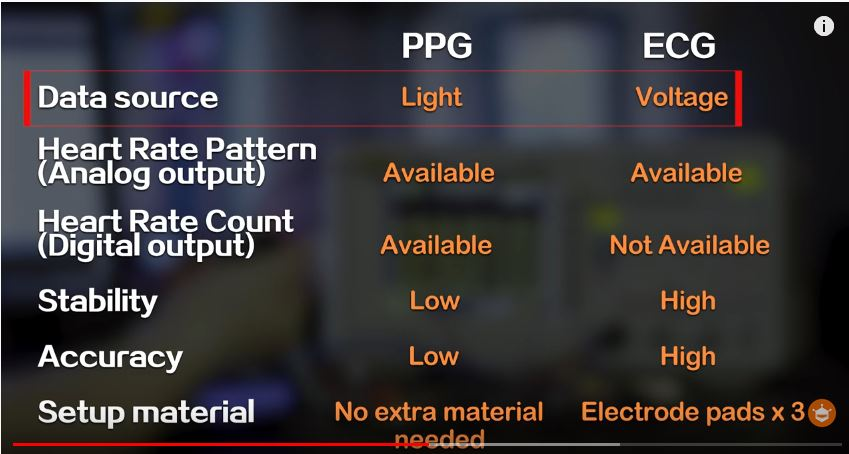

# Heart rate with Arduino: PPG (KY-039) vs ECG (AD8232)

Course project for *Projeto e Conceção de Instrumentos* (Instrument Design), **University of Coimbra**, 2019/2020, Erasmus semester.

**Authors:** Ferdinando Catania, Hugo Sebastião

## Goal

Measure heart rate in two independent ways and compare them:

1. **Pulse (photoplethysmography)** with the low-cost **KY-039** IR sensor, processed **in real time on an Arduino Uno** and shown on a 16×2 LCD. This is the core of the project.
2. **ECG** with the **AD8232** front-end kit, acquired by Arduino and processed **offline in MATLAB** (R-peak detection → R-R intervals → BPM).

## Hardware

- Arduino Uno
- KY-039 heartbeat sensor (IR LED + phototransistor, finger clip)
- SparkFun AD8232 single-lead ECG board + electrodes
- LCD 1602 display
- Voltage divider to adapt the sensor output range

## Repository layout

| Path | Content |
| --- | --- |
| `firmware/ky039_ppg/` | Real-time heart rate from KY-039: 22-sample moving average (also removes 50 Hz light flicker), slope-sign peak detection, calibrated BPM on LCD, sensor-fault message |
| `firmware/combined_hugo/` | Alternative PPG algorithm (by Hugo Sebastião): finger detection by threshold, moving-average filter, local-maximum detection over a sliding window, 3-beat averaged BPM |
| `firmware/ky039_raw/` | Raw KY-039 signal streaming over serial, used to tune the filter |
| `firmware/ecg_ad8232/` | ECG acquisition sketch (based on the SparkFun AD8232 example), streams samples over serial |
| `firmware/fft/` | Spectrum of the ECG signal on Arduino using `arduinoFFT` (Hamming window, 128 samples) |
| `matlab/` | Offline analysis: plots of PPG and ECG, threshold + local-max R-peak detection, R-R intervals and heart rate; `.mat` files with the recorded data |
| `images/` | Results and setup photos |
| `docs/` | Problem definition and final report *Development and testing* (PDF) |

## Results

Raw vs filtered ECG acquired with the AD8232:

| Without filtering | With filtering |
| --- | --- |
|  |  |

Comparison between the two methods:

## How to run

- **Arduino:** open the sketch in the Arduino IDE (the FFT sketch needs the `arduinoFFT` library), PPG sensor on `A0`, ECG output on `A1`, LCD on pins 12, 11, 5, 4, 3, 2.
- **MATLAB:** run `matlab/script.m` from inside the `matlab/` folder. It loads `pulse.mat`, `ecg.mat` and `position pulse peaks.mat` (PPG peak positions picked manually with `ginput`). `data.mat` is the raw 3-column acquisition streamed from the Arduino (time in ms, PPG, ECG).

## Skills

Embedded C/C++ (Arduino) · biosignal acquisition · digital filtering · peak detection · MATLAB signal processing · analog front-end
